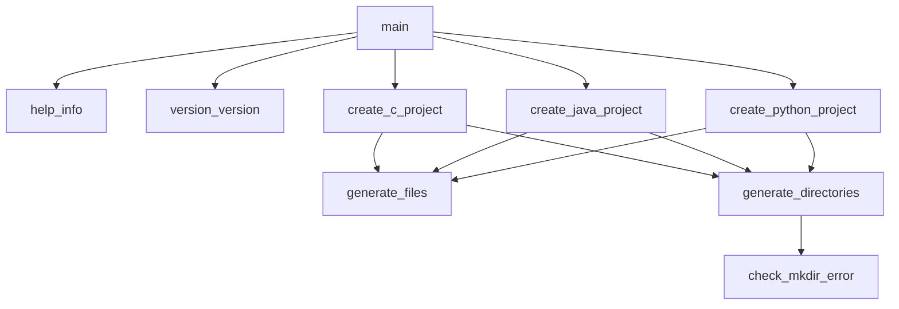
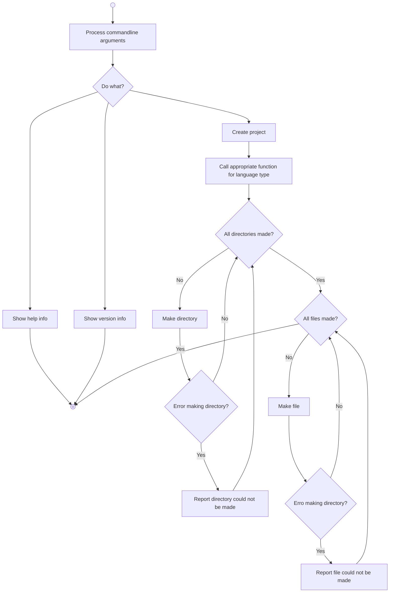

<!--
Copyright (c) 2026 Richard Varela
This file is part of Progex which is release under 3-Clause BSD.
See LICENSE for details.
-->

**Table of Contents**

- [Introduction](#introduction)
- [Conventions](#conventions)
	- [Style](#style)
	- [Source File Locations](#source-file-locations)
- [Design](#design)
	- [Hierarchy Chart](#hierarchy-chart)
	- [Flowchart](#flowchart)
- [Build Guide](#build-guide)
	- [Debug](#debug)
	- [Clean Up](#clean-up)

- - -

# Introduction

This document contains all information related to developing Progex, covering conventions, design, and building.

# Conventions

The following sections go over the project's conventions related to style and source file placements.

## Style

The following are the styling guidelines for the source files:

- Snake case is used for function and variable names.
- Verbs are used for functions.
- Nouns are used for variables and constants.
- The source file name should match the function name, unless the source file name is for a collection of functions.
- Instead of writing multiple `printf` statements for each unique line, utilize C's string concatenation.
- Use K&R style for brace placement.
- Use comments when you can express clearly in code.

## Source File Locations

The following show the directory structure.

```text
progex/
|--build/
|--docs/
|  |--development_documentation.md
|  |--manual.md
|--include/
|  |--All header files
|--src/
|  |--All source files
|--tests/
|--makefile
```

# Design

## Hierarchy Chart

The following shows the hierarchy of Progex's functions.



## Flowchart

The following flowchart shows the application's logical flow.



# Build Guide

To build the Progex, simple run `make`.
This will run the following in the `makefile`:

```makefile
default: $(OBJFILES)
        gcc -Wall $(OBJFILES) -o ./build/a.exe
```

where `$(OBJFILES)` represents all objects files made by the compiler.

## Debug

To debug, run `make debug` to compiler the entire application with debugging information.
This will also start GDB.

## Cleaning Up

To clean up object files and the compiled program for whatever reason, just simple run `make clean`.
